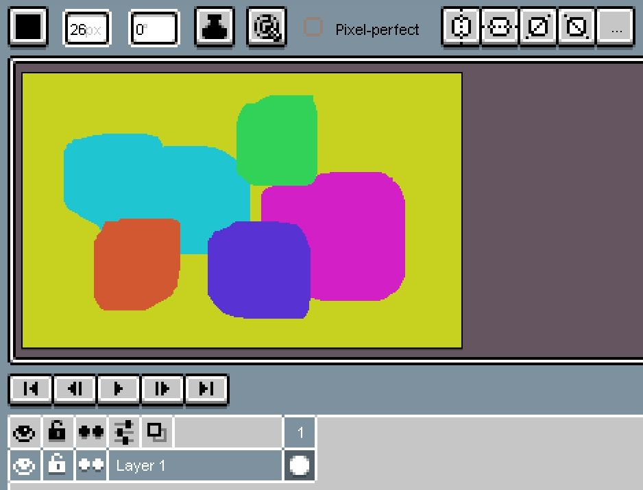
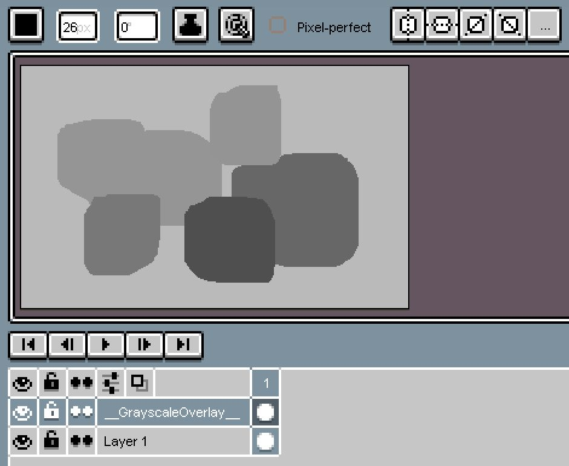
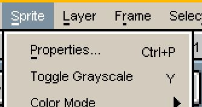
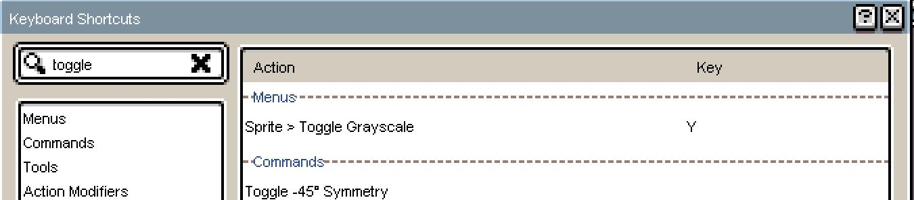

A quick way to check color contrast in Aseprite (this extension is tested with version 1.3.14.3)

This extension inserts and removes a 'black layer with blendmode COLOR' over your entire timeline. Something you could do yourself.
But isn't it much quicker to just press one key? :-)

Easy Installation:
1) Go to menu Edit --> Preferences --> Extensions
2) Click 'Add Extension' and choose the downloaded ToggleGrayscale.zip
3) Restart Aseprite

Usage:
1) Under menu Sprite -> 'Toggle Grayscale'
2) Or assign a keyboard shortcut. Go to menu Edit --> Keyboard shortcuts --> Search for 'Toggle Grayscale' and assign e.g. key 'Y'
 
 

Example Timeline without overlay

 
 
 
Example Timeline with overlay

 
 
 
 
 
Use it via toolbar
 

 
 
 
Or assign a shortcut

